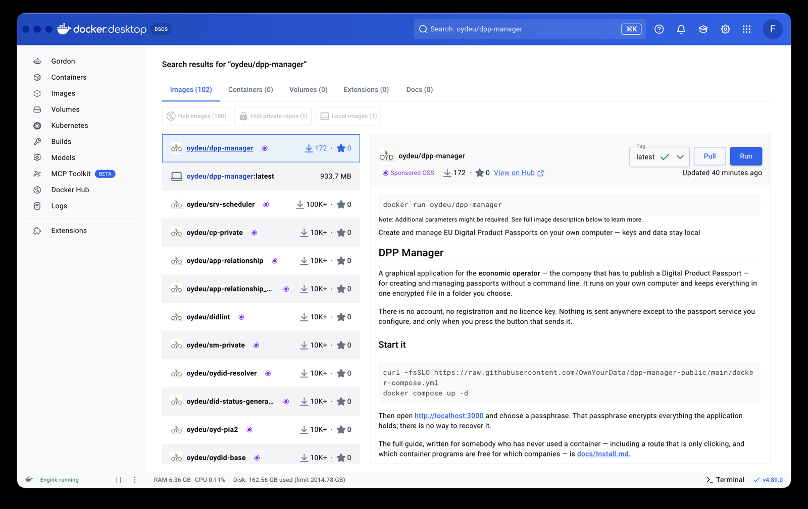
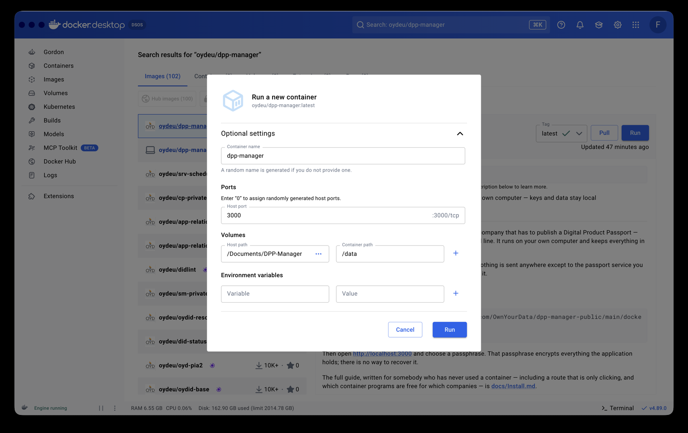
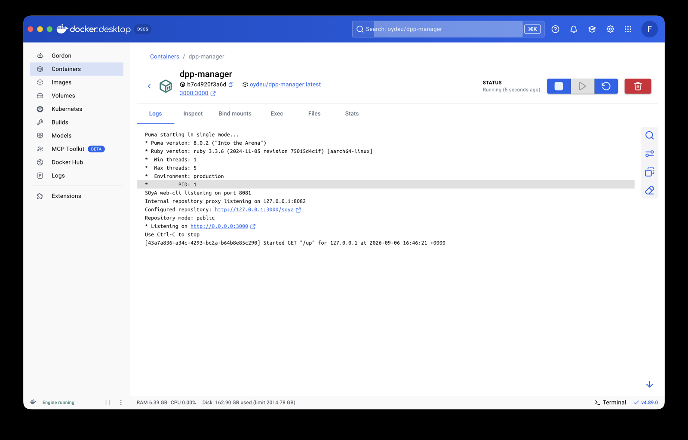
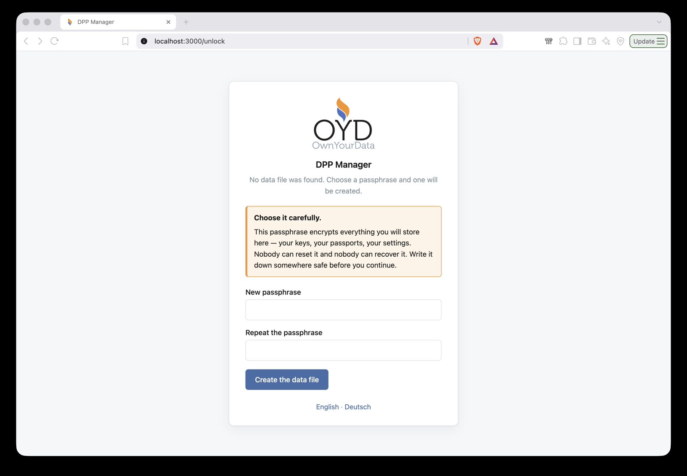

# Installing the DPP Manager

The DPP Manager runs on your own computer. Nothing about your passports, your
keys or your products is sent anywhere except to the passport service you
choose, and only when you press the button that sends it.

It is delivered as a **container image** — a way of shipping an application
together with everything it needs, so that nothing has to be installed piece by
piece. That means one thing has to be on the computer first: a program that can
run containers. After that, the DPP Manager itself is a download and a start,
and you use it in your browser like any other page.

There are two installations, then. This page covers both.

---

## 1 — A program that runs containers

Pick one. All three do the same job here; they differ in what they cost and
which computers they run on.

| | Runs on | Costs |
|---|---|---|
| [**Docker Desktop**](https://www.docker.com/products/docker-desktop/) | macOS, Windows, Linux | free for a company with fewer than 250 employees **and** under 10 M USD annual revenue; otherwise a paid subscription. Public bodies need a subscription in any case. |
| [**Podman Desktop**](https://podman-desktop.io/) | macOS, Windows, Linux | free, including commercial use |
| [**Rancher Desktop**](https://rancherdesktop.io/) | macOS, Windows, Linux | free, including commercial use |

If none of this means anything to you and your company is small: take Docker
Desktop. It is the one most guides on the internet assume, and the licence
covers you.

Install it, start it once, and leave it running. It puts an icon in the menu bar
(macOS) or the system tray (Windows). Everything below assumes it is running.

> **Podman Desktop** needs one extra step before the command in section 2b works:
> in the application, under *Settings → Resources*, set up **Compose**. It offers
> to install it for you.
>
> **Rancher Desktop** asks on first start which container engine to use. Choose
> **dockerd (moby)**, then the commands below work unchanged.

---

## 2 — The DPP Manager

Two ways. **2a** is clicking and works with Docker Desktop. **2b** is one line in
a terminal and works with all three. The result is identical.

### 2a — Without a terminal (Docker Desktop)

Before you start, make a folder for your data — a new, empty one, somewhere you
will find it again, for example *Documents/DPP-Manager*. Avoid spaces in the
name; they make life harder later if you ever want to copy the folder from a
terminal.

**Find the application.** In the blue bar at the top of Docker Desktop there is
a **Search** field (or press ⌘K / Ctrl-K). Type `oydeu/dpp-manager` and pick the
first result.



The panel on the right shows what it is and offers **Pull** and **Run** next to
a tag, which should say `latest`. **Run** fetches the application if it is not
there yet, so that is the only button you need — press **Pull** first only if
you have used the DPP Manager before and want the current version.

**Set three things.** After **Run** a dialog appears called *Run a new
container*. Open **Optional settings** and fill in:

* **Container name** — `dpp-manager`, so you can recognise it later. Left empty,
  Docker invents something like *nostalgic_hopper*.
* **Host port** — `3000`. The `:3000/tcp` on the right of that field is the port
  inside the container and is not editable; what you type on the left is the
  port on your own computer. If something else already uses 3000, type `3100`
  here and open `http://localhost:3100` later instead.
* **Volumes → Host path** — press the `…` button and choose the folder you made.
  **Container path** — `/data`, exactly that.

*Environment variables* stays empty.



Then **Run**.

**That was it.** Docker Desktop switches to the container and shows its log. The
status says *Running*, and next to the name is `3000:3000` as a link that opens
the application.



The folder you chose is where your data will live. Section 4 explains why that
matters.

### 2b — With one command (any of the three)

Make a folder for this, put the configuration file in it, and start:

```
mkdir -p ~/Documents/dpp-manager && cd ~/Documents/dpp-manager
curl -fsSLO https://raw.githubusercontent.com/OwnYourData/dpp-manager-public/main/docker-compose.yml
docker compose up -d
```

On Windows, use PowerShell and replace the first line with
`mkdir $HOME\Documents\dpp-manager; cd $HOME\Documents\dpp-manager`.

With Podman Desktop the last line is `podman compose up -d`.

The file you download is a small configuration that says which image to start,
which port to use and which folder to keep the data in. You do not have to write
it, and you do not have to understand it — but you can read it, it is nine lines
of plain text.

---

## 3 — Open it

In a browser: **http://localhost:3000**

On the first start it asks you to choose a passphrase. That passphrase encrypts
everything the application will hold — your keys, your passports, your settings.



> **There is no way to recover it.** Not by us, not by anyone. The data is
> encrypted with a key derived from the passphrase and from nothing else. Write
> it down somewhere safe before you continue.

After that the application takes you through a short setup: which passport
service to write to, an identity of your own, and where your passports should be
kept. Each screen explains itself.

---

## 4 — Where your data is

Everything is in **one file**, `dpp.db`, in the folder you chose. Not spread
across the computer, not in a database somewhere, not in a cloud.

```
DPP-Manager/
└── dpp.db      everything: passports, keys, settings, the log
```

On route 2b the file sits one level down, in a `data` folder next to the
configuration file — same file, same meaning.

That file is encrypted with your passphrase. Copying the folder is a backup.
Copying it to another computer and starting there with the same passphrase moves
your work. Losing it without a copy loses the passports — which is the price of
nobody else having them.

The application can write a consistent backup copy for you: *Administration →
Data file → Create a backup copy*. That is safer than copying the file while the
application is writing to it.

---

## 5 — Every day after that

| | Docker Desktop | Terminal |
|---|---|---|
| stop it | *Containers*, the stop button | `docker compose down` |
| start it | *Containers*, the play button | `docker compose up -d` |
| a newer version | search for `oydeu/dpp-manager` again, **Pull**, then delete the container and run it as in 2a | `docker compose pull && docker compose up -d` |

Your folder is untouched by all of these — deleting the container does not touch
the data, which is why the update above is safe.

One difference between the two routes: a container started the way 2b describes
comes back by itself after the computer is restarted, because the configuration
file says so. One started by clicking in 2a does not — you press the play button
in *Containers* once after each restart. If that bothers you, route 2b is the
one to take.

---

## 6 — If something does not work

**The page does not open.** Look in *Containers* — the DPP Manager should be
there and marked *running* or *healthy*. If it says *exited*, open its log; the
first red line usually says what is wrong.

**"Port is already allocated" or the page shows something else entirely.**
Something else on the computer is using port 3000. Give the DPP Manager another,
for instance 3100: in Docker Desktop set the host port to `3100` when running
the image, or, on route 2b, create a file called `.env` next to
`docker-compose.yml` containing `DPP_MANAGER_PORT=3100`. Then open
`http://localhost:3100`.

**"The data directory is not writable."** On Linux the folder has to belong to
user id 1000, which is the user inside the container:
`sudo chown 1000:1000 data`. macOS and Windows handle this themselves.

**You forgot the passphrase.** There is nothing anybody can do. If the file
holds nothing you need yet, delete `dpp.db` and start again; the application
will offer to create a new one.

---

## What this does not need

No account. No registration. No licence key. No connection to us. The DPP
Manager talks to the passport service you configure and to the public registry
that resolves identifiers — nothing else, and nothing at all until you ask it
to.
